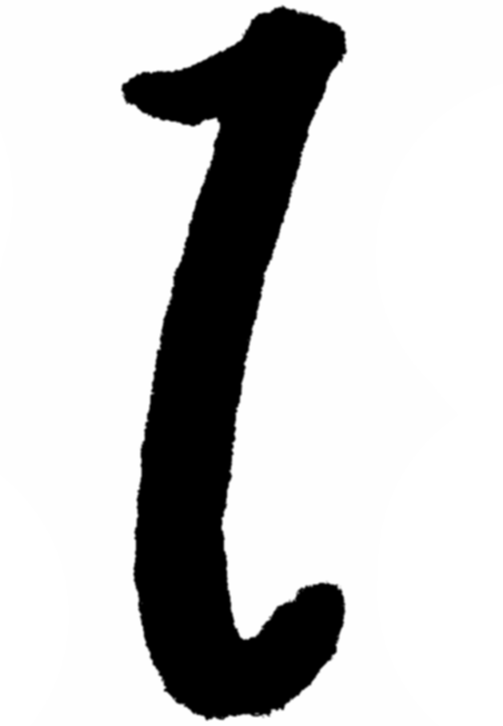

# </img>: An HTML Generation Library for Javascript

</img> is a Javascript library that makes generating HTML easier.

When you want to create HTML dynamically you have to use the DOM API. 
The DOM API is verbose, and can require multiple statements to generate a single node to your liking. 
</img> gives a declarative style to DOM creation and allows for describing HTML structures in a single statement.

Try it out online [here](http://idiocode.com/projects/l/index.html#try)!

</img>:
```javascript
l(() => div(
    h1('Example'),
    div(p('Important'), hr, p('content'), span(span(span('Nesting is easy.')))),
    section(header(h1('HTML 5 is supported too!'))),
    div('Properties can be set', { style: { color: 'red'}, onchange: () => alert('clicked') }),
    div('Attributes can be set too!', { class: 'wow' }))
);
```

HTML:
```html
<div>
    <h1>Example</h1>
    <div>
        <p>Important</p>
        <hr>
        <p>content</p>
        <span><span><span>Nesting is easy.</span></span></span>
    </div>
    <section>
        <header><h1>HTML 5 is supported too!</h1></header>
    </section>
    <div style="color: red;">Properties can be set</div>
    <div class="wow">Attributes can be set too!</div>
</div>
```

## Installation
blahbl ablhb lahblabh albhalbh albhalba
b ahblahbhalb halb halb halbh abl hablhab
a bhl ablhablahblahblahb lahbalbhalbha
balhblabh

## Usage
Once you've downloaded the library, include it in your HTML page, or import via es6 imports.

</img> exports one variable called `l`. The following sections will go over the specifics of what you can do with this object.

## Generating Elements
There are multiple ways to generate HTML through the `l` object. 
The most straightforward way is to create a tag by calling the tag name by using the dot operator on the `l` object.

```javascript
l.div()
// <div></div>

l.section()
// <section></section>
```

Most HTML tags are supported this way. If you have an HTML tag that doesn't have a function in the `l` object, you can make your
own by calling `l` as a function:

```javascript
l('customtag')
// <customtag></customtag>

l('burrito')
// <burrito></burrito>
```

Later on, when we learn about adding children, you'll see examples where we can omit calling one of the tag functions:

```javascript
l.div(l.br, l.hr)
```

See how we used `l.br` and `l.hr` without calling them like `l.br()` and `l.hr`? This works for all nodes when they are children.

## Adding Content
Now we can make tags, but how can we add content to them? From both of the techniques above, we can
add one more argument to the function calls. You can pass it a string to set the innerHTML:

```javascript
l.div('This is the innerHTML')
// <div>This is the innerHTML</div>

l('burrito', "I'm in a burrito")
// <burrito>I'm in a burrito</burrito>
```

## Attributes and Properties
You can pass an object to configure attributes and properties:

```javascript
l.div({ style: { color: 'pink'}})
// <div style="color: pink;"></div>

l('burrito', { id: 'special' })
// <burrito id="special"></burrito>

l.span({ innerHTML: 'You can set the html like this too' })
l.span({ html: 'You can set the html like this too' })
// <span>You can set the html like this too</span>
```

In the object that we passed, </img>  will try to guess if the value should be set as an attribute, or a property on the node.
If you want to force a value to be a property or attribute explicitly you can use the reserved key `attrs` for attributes
and `props` for properties:

```javascript
l.textarea({ value: 'My value' })
// <textarea value="My value"></textarea>

l.textarea({ props: { value: My value' }})
// <textarea></textarea>
```

Notice how </img>  inferred that `value` was an attribute, but when told to use it as a property it will be assigned to the node 
as a property. This results in the HTML not containing the potentially long `value` attribute, but it is still shown in the HTML. 


You can mix these two arguments (the string and object) to make the syntax more compact:
```javascript
l.div('This is the text', { style: { color: 'red' }});
// <div style="color: red;">This is the text</div>
```

## Children
There are two ways of adding children to a node. You can pass a list as one of the arguments:

```javascript
l.div([l.span, l.span])
// <div><span></span><span></span></div>
```

Or you can add any number of additional arguments as nodes:

```javascript
l.div(l.span)
// <div><span></span></div>

l.div(l.span, l.span)
// <div><span></span><span></span></div>
```

Children don't have to be nodes either. You can pass strings, or numbers and they will be converted to
text nodes:

```javascript
l.div(l.span('a', 'b', 'c'), 'd')
// <div><span>abc</span>d</div>

l.span(1, 2, 3, l.div(4, 'five', l.div(l.div('six'))))
// <span>123<div>4five<div><div>six</div></div></div></span>
```

### </img>  Function
You know how we have been saying `l.div` and `l.span`? That isn't what the example code looks like is it? To get the pretty
code you see in the examples, you have to use </img>  functions. An </img>  function is a shortcut so that you 
can skip typing `l.` all the time. Everything works the same as before. All the arguments are the same, its just easier to type.
The main advantage is that you can feel like you're typing actual HTML instead of using a library.

```javascript
// without l function
l.div(l.span('A little more typing'), l.br, l.span('But still good'))

// with l function
l(() => div(span('Feels more like writing HTML), br, span('Pretty cool')))

// with l function
l.div(() => span('You use it anywhere'), () => l.br, () => l.span('Yeah'))
```

There is a small performance overhead that comes with using </img>  functions. If you are using this to create a Javascript interface
for a rocketship that would benefit from being 0.001 milliseconds faster, look elsewhere. But, everyone else in the world can enjoy the
cleaner interface.

A good trait of </img>  functions is that they allow for omitting the `l.`, without tainting the outer or global scope:

```javascript
var a = "Can't touch this";
l(() => a('What are you talking about', { href: '#' }));
// <a href="#">What are you talking about</a>
console.log(a === "Can't touch this");
```

See how inside of the </img>  function, `a` changed its value from being `"Can't touch this"` to being a function that creates an anchor tag? Even better,
the `a` defined in the outer scope is untouched. You can think of any tag name as a reserved keyword inside of an </img>  function.
If you need to close a variable over an </img>  function, you should make sure it isn't the name of an HTML tag, as it will not
be visible inside of the </img>  function.

## Appending to Existing Nodes
</img>  supports a way of appending children to existing DOM nodes. When you use `l` as a function, as we have done "Generating Elements",
you can pass `l` an existing DOM node, and it will append any nodes that are given after it to that node.

```javascript
l(document.body, () => div("I've been appended!"))
// <body> ... <div>I've been appended!</div></body>
```

This works as you are building elements too:

```javascript
l(l.article, () => section(h1('First Part'), p), () => section(h1('Second Part'), p))
```

## Put Them All Together
Try mixing-and-matching adding content, with attributes and properties along with adding children and see what happens.
Put things where you think they ought to be, and see if it works. Its easy to check the output by looking at `outerHTML`.

```javascript
l.div(1, () => div(span, br, () => div, article, 'oiwjef'), 'three', l.hr, l.br, 'four')
// <div>1<div><span></span><br><div></div><article></article>oiwjef</div>three<hr><br>four</div>
```

That's a complicated example, but it shows how all the arguments we learned about can be nested together
and used interchangably. </img>  makes sense of whatever mess you give it. So try to give it your own mess
and see what it gives you back :)

## Related Libraries
The idea of generating HTML in programming languages is old. It has been (almost famously) re-invented in lisps many times. [spinneret](https://github.com/ruricolist/spinneret), for example, is a library for generating HTML5. Programming languages like prolog, python, and c have done it too. However, these programming languages don't run directly in the browser like Javascript does. Those libraries are created for web servers or static page generation. Having access to the DOM allows nodes to be created dynamically and for creating interactive HTML. This makes Javascript a good use case for such a library.

The browser already has the capability of generating HTML through a builtin interface: the DOM. 
I've used the DOM enough to know how time consuming it is to use. Take a look at how hard it is to generate `<div><span>This is tedious!</span></div>` and append it to `document.body`:

```javascript
const node = document.createElement('span');
node.innerHTML = 'This is tedious!';
const container = document.createElement('div');
container.appendChild(node);
document.body.appendChild(container);
```

Others have noticed how inefficient this is too and have created libraries to make using it faster for the programmer. Here are some of the libraries that came before </img>  and inspired my work:
- [crel](https://github.com/KoryNunn/crel) - Similar in function to </img> with interface differences.
- [laconic](https://github.com/joestelmach/laconic) - Similar to crel (crel says this was its inspiration).
- [RE:DOM](https://redom.js.org/) - Influenced by web components.

## License

```
Copyright 2019 Adam Bertrand Berger

Permission is hereby granted, free of charge, to any person obtaining a copy of this software and associated documentation files (the "Software"), to deal in the Software without restriction, including without limitation the rights to use, copy, modify, merge, publish, distribute, sublicense, and/or sell copies of the Software, and to permit persons to whom the Software is furnished to do so, subject to the following conditions:

The above copyright notice and this permission notice shall be included in all copies or substantial portions of the Software.

THE SOFTWARE IS PROVIDED "AS IS", WITHOUT WARRANTY OF ANY KIND, EXPRESS OR IMPLIED, INCLUDING BUT NOT LIMITED TO THE WARRANTIES OF MERCHANTABILITY, FITNESS FOR A PARTICULAR PURPOSE AND NONINFRINGEMENT. IN NO EVENT SHALL THE AUTHORS OR COPYRIGHT HOLDERS BE LIABLE FOR ANY CLAIM, DAMAGES OR OTHER LIABILITY, WHETHER IN AN ACTION OF CONTRACT, TORT OR OTHERWISE, ARISING FROM, OUT OF OR IN CONNECTION WITH THE SOFTWARE OR THE USE OR OTHER DEALINGS IN THE SOFTWARE.
```
